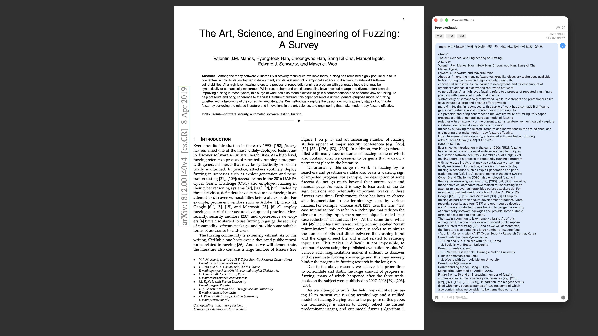
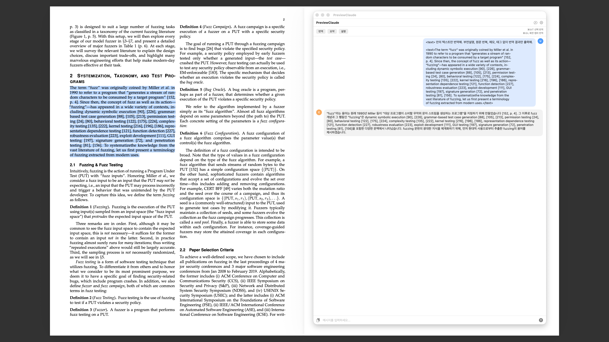
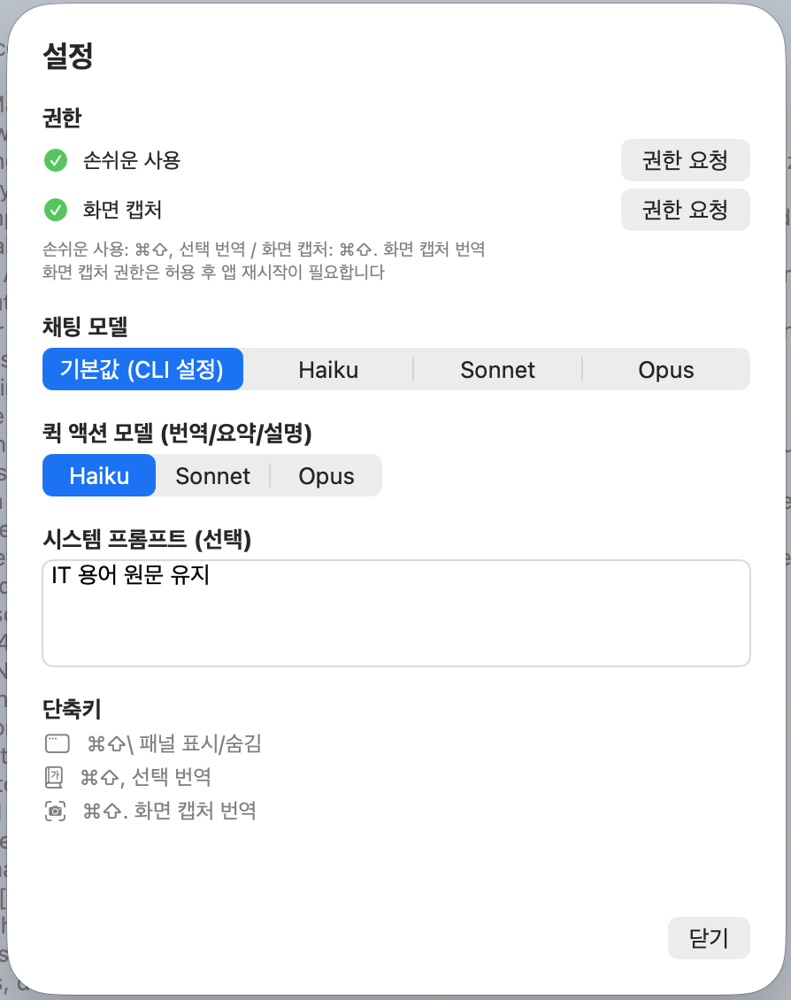

# TranslatePanel

A macOS menu-bar LLM translation panel that works anywhere on your screen.

Supports multiple LLM CLI tools (Claude, Codex, Gemini, Qwen, Apfel, Copilot). No separate API key needed — it reuses your existing CLI authentication.

OCR-extracted text often contains broken line breaks, missing characters, or garbled words, which degrades translation quality when using conventional translators. By using an LLM, the app understands context and delivers natural translations.

Vibe coded with **Claude Opus 4.6** via [Claude Code](https://github.com/anthropics/claude-code).

[한국어](README_ko.md)

## Screenshots

| Capture Translate (⌘⇧.) | Select Translate (⌘⇧,) |
|:---:|:---:|
|  |  |

| Region Capture Translate (⌘⇧') |
|:---:|
|  |

| Image Drop Translate | Settings |
|:---:|:---:|
|  |  |

## Features

- **Toggle Panel (⌘⇧\\)** — Show/hide the floating panel
- **Select Translate (⌘⇧,)** — Drag to select text, auto-copy + translate (requires Accessibility permission)
- **Capture Translate (⌘⇧.)** — Captures the full screen (excluding the panel) and extracts text via Vision OCR, then translates (requires Screen Recording permission)
- **Region Capture Translate (⌘⇧')** — Drag to select a screen region, extracts text via Vision OCR, then translates (requires Screen Recording permission)
- **Image Drop Translate** — Drag & drop an image onto the panel to extract text via Vision OCR and translate
- **Quick Actions** — Translate / Summarize / Explain buttons
- **Provider Selection** — Switch between Claude, Codex, Gemini, Qwen, Apfel, Copilot via Settings
- **Model Selection** — Free-form model name input (per-provider, e.g., sonnet, gpt-5.4-mini, gemini-2.5-flash, qwen-flash-latest)
  - Claude and Codex reasoning effort is set to `low` for fast translation responses
  - Apfel uses Apple Intelligence's default model (no model selection)
- **Text-to-Speech** — Read responses aloud using macOS `say` command with adjustable speed. Uses the system default voice — to change it, go to **System Settings > Accessibility > Spoken Content > System Voice**
- **System Prompt** — Customize translation style (e.g., keep IT terms in original)
- **Localized UI** — Automatically switches between Korean/English based on system language
- **Floating Panel** — Always-on-top window for use alongside any app

## Requirements

- **macOS 14.0+**
- At least one supported LLM CLI installed and authenticated:
  - [Claude Code CLI](https://github.com/anthropics/claude-code) (`claude`)
  - [Codex CLI](https://github.com/openai/codex) (`codex`)
  - [Gemini CLI](https://github.com/google-gemini/gemini-cli) (`gemini`)
  - [Qwen CLI](https://github.com/QwenLM/qwen-code) (`qwen`)
  - [Copilot CLI](https://github.com/github/copilot-cli) (`copilot`)
  - [Apfel CLI](https://github.com/Arthur-Ficial/apfel) (`apfel`)
- Swift 5.10+

## Build & Install

```bash
# Build
bash build.sh

# Run
open build/TranslatePanel.app

# Install (copy to Applications)
cp -r build/TranslatePanel.app /Applications/
```

## Permissions

Permissions can be requested from the app settings (⚙).

| Permission | Purpose | Required |
|------------|---------|----------|
| Accessibility | ⌘⇧, auto text extraction from selection | Optional (without it, manually copy first) |
| Screen Recording | ⌘⇧. screen capture, ⌘⇧' region capture translate | Required for ⌘⇧. / ⌘⇧' (app restart needed) |

## Limitations

- **macOS only** — Uses macOS native frameworks: ScreenCaptureKit, Vision, Accessibility API
- Requires at least one supported LLM CLI tool installed
- Claude's `claude -p` usage context: ([Thariq's Post](https://x.com/trq212/status/2024212380142752025), [archive](images/post.png))
- Capture translate uses the same Vision OCR engine as macOS Live Text
- Screen capture automatically excludes the TranslatePanel panel, so it works even while the panel is open

