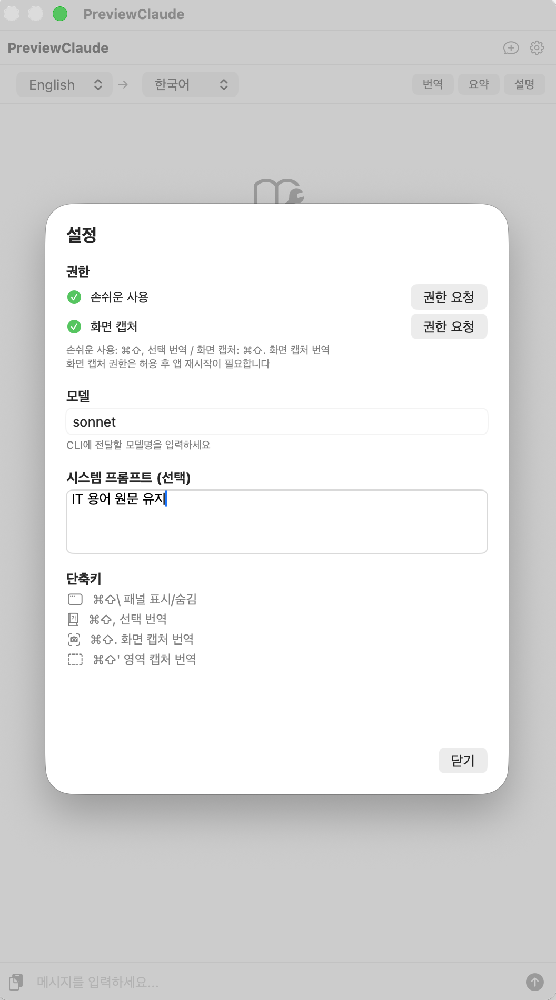

# PreviewClaude

macOS 미리보기(Preview) 앱 위에서 사용하기 위한 Claude 번역 패널입니다.

[`claude -p`](https://code.claude.com/docs/ko/cli-reference) CLI를 활용하므로 별도 API 키 없이 기존 Claude 인증을 그대로 사용합니다.

[Claude Code](https://github.com/anthropics/claude-code)에서 **Claude Opus 4.6**을 사용하여 바이브 코딩했습니다.

## 스크린샷

| 화면 캡처 번역 (⌘⇧.) | 선택 번역 (⌘⇧,) |
|:---:|:---:|
|  |  |

| 이미지 드롭 번역 | 설정 |
|:---:|:---:|
|  |  |

## 주요 기능

- **패널 표시/숨김 (⌘⇧\\)** — 플로팅 패널 표시/숨김
- **선택 번역 (⌘⇧,)** — 텍스트를 드래그하면 자동 복사 + 번역 (손쉬운 사용 권한 필요)
- **화면 캡처 번역 (⌘⇧.)** — 현재 활성 창을 캡처하고 Vision OCR로 텍스트 추출 후 번역 (화면 기록 권한 필요)
- **이미지 드롭 번역** — 이미지를 패널에 드래그앤드롭하면 Vision OCR로 텍스트를 추출하고 번역
- **퀵 액션** — 번역 / 요약 / 설명 버튼
- **모델 선택** — 채팅 모델과 퀵 액션 모델을 분리 선택 (sonnet, haiku, opus)
- **시스템 프롬프트** — 번역 스타일 커스텀 가능 (ex: IT 용어 원문 유지)
- **다국어 UI** — 시스템 언어에 따라 한국어/영어 자동 전환
- **플로팅 패널** — 항상 위에 떠 있어 미리보기와 함께 사용 가능

## 요구사항

- **macOS 14.0+**
- **[Claude Code CLI](https://github.com/anthropics/claude-code)** 설치 및 인증 완료
- Swift 5.10+

## 빌드 및 설치

```bash
# 빌드
bash build.sh

# 실행
open build/PreviewClaude.app

# 설치 (Applications 폴더로 복사)
cp -r build/PreviewClaude.app /Applications/
```

## 권한 설정

앱 설정(⚙)에서 권한을 요청할 수 있습니다.

| 권한 | 용도 | 필수 여부 |
|------|------|-----------|
| 손쉬운 사용 | ⌘⇧, 드래그 텍스트 자동 추출 | 선택 (없으면 수동 복사 후 번역) |
| 화면 기록 | ⌘⇧. 화면 캡처 번역 | ⌘⇧. 사용 시 필수 (앱 재시작 필요) |

## 제한사항

- **Claude 전용** — [`claude -p`](https://code.claude.com/docs/ko/cli-reference) CLI를 사용하므로 Claude Code가 설치되어 있어야 합니다 ([Thariq's Post](https://x.com/trq212/status/2024212380142752025), [archive](images/post.png))
- **macOS 전용** — ScreenCaptureKit, Vision, Accessibility API 등 macOS 네이티브 프레임워크를 사용합니다
- 화면 캡처 번역은 macOS의 Live Text와 동일한 Vision OCR 엔진을 사용합니다

